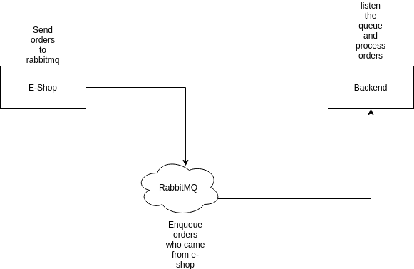

# rabbitmq-shop-processing

Sometimes you need a architecture to prevent bottle neck on your application. Let's supose a e-shop who receives a rest call (e.g. 1000 times / second). In particular time, this rate raise to (1000000 times/ second) who cause bottle neck. Then use queue aproach to reduce this problems.

# Application architecture



# Getting Started

This project show features which a minimal API must have on my own opinion.

### Prerequisites

You will need a java version installed (11 or later) and a IDE to run locally. (STS or Eclipse EE). Also a rabbitmq server (either local or hosted)

### Installing

I'll give you a hand a tell how to install this project on you own machine.

First, clone the project to your local storage.

Then,

```
After unzip on a directory of your choice, open your favorite java IDE and import the project as maven project
```

Finally,

```
Run the application as spring boot
```

## Built With

- [Spring Boot](https://spring.io/projects/spring-boot) - The web framework used
- [Maven](https://maven.apache.org/) - Dependency Management
- [RabbitMQ](https://www.rabbitmq.com/) - Message Broker

## License

This project is licensed under the MIT License
